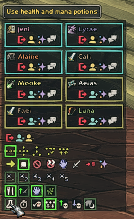
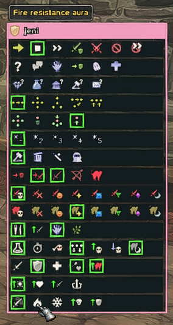

# PlayerBot Addon

In the WoW private server community there was a guy named [ike3](http://ike3.github.io/mangosbot-docs/) who wrote a bot script that would create robot players in the game.  You could have hundreds of them, and they would run around and fight and do quests and they would even use the Auction House.  You could party with them, and even better you could bring your alts and play with them too.

Efforts are underway to port this bot code to [AzerothCore](http://www.azerothcore.org) via the [PlayerBots](https://github.com/ZhengPeiRu21/mod-playerbots) module.  This repository is an addon project that will facilitate managing the bots by the player ingame.  It begins as a fork of ike3's [original](https://github.com/ike3/mangosbot-addon) addon package which he developed for the Mangos project.

## Install

Download this [zip](https://github.com/whipowill/wow-addon-playerbot/archive/master.zip) into your ``C:\\Games\WoW\Interface\Addons\PlayerBot`` directory.

## Usage

Type `/bot` into the WoW chat bar to bring up the roster window.

Click on the bot character, making him your target, to bring up the control window.

## Changelog

- Minor edits to original code to work PlayerBots.
- Made it so SelectedBotPanel only shows if RosterPanel is already open.

## References

- [ike3's Initial Announcement](https://www.getmangos.eu/forums/topic/5401-ai-playerbot/)